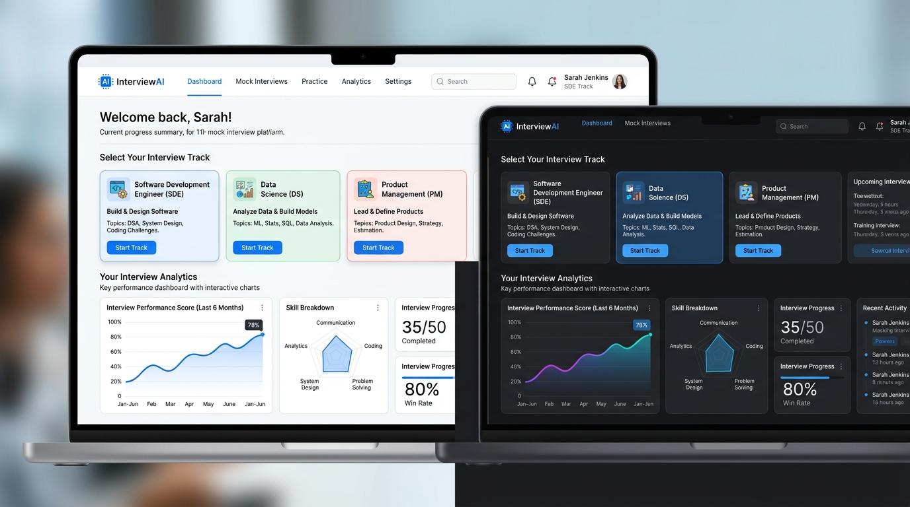
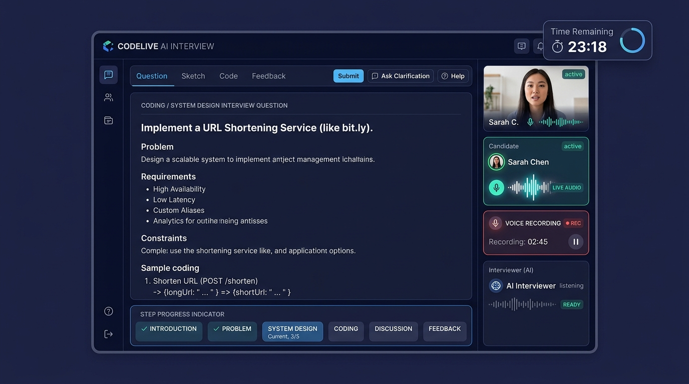
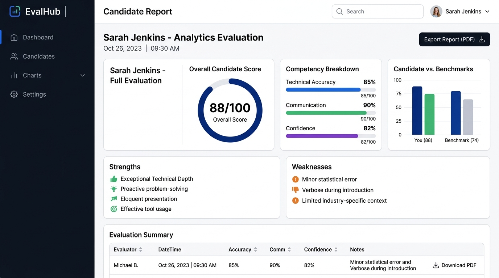

# InterviewAI

**AI-powered mock interview platform** for practicing technical and behavioral interviews. Candidates pick a role track, difficulty, and (optionally) a target-company style, then go through a live Q&A session — spoken or typed — that's transcribed, scored, and followed up on in real time by Google Gemini. Sessions end with a scored report, strengths/weaknesses breakdown, a personalized study plan, and a downloadable PDF.

Built as a full-stack app: React 19 (Vite) on the frontend, an Express API on the backend, Gemini for all AI generation/evaluation/transcription, and a lightweight JSON file store for persistence.

---

## 📸 Platform Screenshots & Visual Preview

| Platform Dashboard & Role Tracks | Live Interview Room & Audio Waveform |
| :---: | :---: |
|  |  |
| *Select from 10 role tracks, difficulty levels, and target company styles.* | *Interactive live session with audio waveform visualizer and question countdown timer.* |

| Scored Evaluation Report & PDF Export |
| :---: |
|  |
| *Comprehensive candidate scoring breakdown with technical accuracy meters and 7-day study plan.* |

---

## Features

- **Role tracks & company presets** — practice across multiple engineering/PM/HR tracks, optionally tuned to a specific company's interview style (job description input supported).
- **Resume-aware questioning** — upload a resume; Gemini extracts skills and experience and tailors questions to match.
- **Voice or text answers** — record audio answers (transcribed via Gemini) or type them directly.
- **Adaptive follow-ups** — the AI evaluator can trigger a sharper follow-up question when an answer is shallow or incomplete, instead of always moving linearly through a fixed question list.
- **Scoring & feedback** — each answer is scored on technical accuracy, communication, and sentiment/confidence, with written AI feedback.
- **Session reports** — a final aggregate report with overall score, strengths, weaknesses, focus areas, and a suggested practice plan.
- **Performance history & dashboard** — track past sessions and trends over time.
- **PDF export** — download a formatted evaluation report per session.
- **Weekly practice tips** — Gemini-generated tips targeted at a user's weakest category.
- **Admin dashboard** — user list with session counts/average scores, session browsing with filters, and a static question bank reference.
- **Auth** — email/password signup and login, plus a one-click guest mode, backed by JWT sessions.

---

## Recent Fixes

This build includes fixes for the following reported issues:

1. **"Enter Interview Room" appeared to do nothing (confirmed root cause).**
   The app's runtime data store (`data/db.json`) lives inside the project folder, and it gets rewritten on nearly every API call — including the moment a session is created. Vite's dev server watches the whole project for changes to power hot-reload, so every one of those writes was triggering a **full browser page reload** — which wiped out the in-flight client-side navigation to the interview room before it could complete. That's why the session was successfully created (visible under "in progress" on the Dashboard) but the page itself never moved. Fixed by excluding `data/` from Vite's file watcher in `vite.config.ts`, so runtime data writes no longer trigger a reload. Verified by running the dev server, submitting live requests that write to `data/db.json`, and confirming no `[vite] (client) page reload` events fire anymore.

   Additional hardening on top of that root-cause fix:
   - Adding a full-screen loading overlay ("Setting up your interview room…") the moment the button is clicked, so it's unmistakable that something is happening.
   - Auto-scrolling to and highlighting the error banner if the request fails, instead of leaving it out of view.
   - Adding a 45-second client-side request timeout with a clear, actionable message instead of an indefinite silent wait.
   - Wrapping every Gemini API call server-side in a 15–25 second timeout + one automatic retry, so a slow/unresponsive AI call fails fast into the local fallback question bank rather than leaving the request hanging.
   - Guarding the response so navigation only proceeds once a valid session is confirmed, rather than relying on a value that could be `undefined`.

2. **Question count selector was ignored / always felt like 4 questions.**
   The count you pick (3 / 4 / 5) is now clamped and validated on both the client and the server (`Math.min(5, Math.max(3, ...))`), so an out-of-range or missing value can never silently fall back to an unexpected default, and the selection is always honored end-to-end. The submit button and the selector itself now also echo back the exact count you've chosen ("Enter Interview Room · 5 Questions") so there's no ambiguity before you start.

3. **Signup/login accepted invalid email formats and weak passwords.**
   Both the client and the server now validate:
   - Email must match a standard `name@domain.tld` pattern (previously any non-empty string was accepted).
   - Password must be at least 8 characters and contain at least one letter and one number (previously any 6-character string passed).
   - Emails are trimmed and lowercased consistently on signup and login, so `Name@Example.com` and `name@example.com` are treated as the same account.
   - Closed a privilege-escalation gap where signing up with any email merely *containing* the word "admin" (e.g. `administrator@company.com`) was silently granted admin access. Only the designated owner email is now auto-promoted.

4. **AI results/scoring felt inconsistent.**
   All Gemini calls (question generation, answer evaluation, and final report generation) now run through a shared timeout + single-retry wrapper, so a slow or dropped API call degrades gracefully to the built-in local scoring heuristics instead of silently stalling or throwing.

---

## Tech Stack

| Layer | Technology |
|---|---|
| Frontend | React 19, Vite 6, React Router 7, TypeScript, Tailwind CSS 4 |
| UI/UX | Lucide icons, Motion (animations), Recharts (analytics charts) |
| Backend | Express 4, TypeScript (via `tsx` in dev, esbuild-bundled for prod) |
| AI | Google Gemini API (`@google/genai`) — question generation, answer evaluation, audio transcription, resume parsing, weekly tips |
| Auth | JSON Web Tokens (`jsonwebtoken`), password hashing (`bcryptjs`) |
| Persistence | Local JSON file store (`data/db.json`) — no external database required |
| PDF export | `jspdf` + `html2canvas` |

---

## Project Structure

```
.
├── server.ts                  # Express API, auth, session lifecycle, admin routes
├── src/
│   ├── db/store.ts            # File-backed JSON data store (users, sessions, Q&A, plans)
│   ├── services/gemini.ts     # All Gemini API calls (questions, evaluation, transcription, tips)
│   ├── context/AuthContext.tsx
│   ├── components/            # Navbar, Footer, modals, notification card, etc.
│   ├── pages/                 # Landing, Auth, Track Selection, Interview Room, Results,
│   │                          #   Dashboard, History, Profile, Admin Dashboard
│   ├── utils/pdfGenerator.ts
│   └── types.ts
├── vite.config.ts
├── render.yaml                 # Render.com deploy config
├── vercel.json                 # Vercel deploy config
└── .env.example
```

---

## Getting Started

### Requirements
- Node.js 18+
- npm 9+
- A Google Gemini API key ([console.cloud.google.com](https://aistudio.google.com/app/apikey))

### Install

```bash
npm install
```

### Environment variables

Create a `.env` file in the project root:

```env
# Required — Gemini API key used for all AI calls
GEMINI_API_KEY=your_gemini_api_key_here

# Required — secret used to sign JWT session tokens.
# Use a long, random, unique value — do not reuse the value in .env.example.
JWT_SECRET=your_long_random_secret_here

# Optional
PORT=3000
NODE_ENV=development
HOST=0.0.0.0
```

> **Security note:** `JWT_SECRET` must be set in every environment (including production). Do not rely on any default baked into the code — treat it the same as a database password.

### Run in development

```bash
npm run dev
```

The app serves on `http://localhost:3000` (Vite runs in middleware mode behind the same Express server).

### Build & run in production

```bash
npm run build   # builds the frontend and bundles server.ts to dist/server.cjs
npm start        # runs the bundled production server
```

### Type-check

```bash
npm run lint
```

---

## Data & Persistence

User accounts, resumes, interview sessions, questions, answers, and improvement plans are stored in a single JSON file at `data/db.json`, created automatically on first run. This keeps the project dependency-free for local use and small deployments, but has two implications:

- **`data/` must never be committed to version control** — it contains password hashes and user data. Make sure your `.gitignore` excludes it.
- **This store requires a persistent, writable filesystem.** It works on platforms like Render with a persistent disk, but will not retain data on stateless/serverless platforms (e.g. Vercel), since the filesystem resets between invocations. For that kind of deployment, swap in a real database (Postgres, MongoDB, etc.) before going to production.

---

## API Overview

All endpoints are served under `/api`. Authenticated routes require an `Authorization: Bearer <token>` header.

| Area | Endpoints |
|---|---|
| Auth | `POST /api/auth/signup`, `/login`, `/guest`, `GET /me`, `PUT /profile`, `DELETE /account` |
| Resume | `POST /api/resume/upload`, `GET /api/resume/me` |
| Sessions | `POST /api/sessions/start`, `GET /api/sessions`, `GET /api/sessions/:id`, `POST /api/sessions/:id/submit-answer`, `POST /api/sessions/:id/toggle-plan` |
| Admin *(admin role only)* | `GET /api/admin/users`, `/sessions`, `/analytics`, `/question-bank` |
| Notifications | `GET /api/notifications/weekly-tip`, `POST /api/notifications/test-email` |

---

## Deployment

### Render
1. Push the repository to GitHub.
2. Create a new **Web Service** on [Render](https://render.com), pointing at the repo.
3. Build command: `npm run build` · Start command: `npm start`.
4. Set `GEMINI_API_KEY` and `JWT_SECRET` as environment variables (`render.yaml` is already configured to prompt for these).

### Vercel
Only recommended if you first replace the file-based store with an external database — see [Data & Persistence](#data--persistence). Otherwise, sessions and accounts will not survive between requests.

---

## Security Checklist Before Production

- [ ] Set a strong, unique `JWT_SECRET` in every environment — never fall back to a default.
- [ ] Assign the `admin` role explicitly (e.g. via a seed script or manual DB edit) rather than any signup-time heuristic based on email text.
- [ ] Confirm `data/` (or your production database credentials) is excluded from version control.
- [ ] Add rate limiting and a CORS policy appropriate to your deployed domain.
- [ ] Rotate the Gemini API key if it has ever been committed to source control.

---

## License

Distributed under the MIT License. Add a `LICENSE` file with the standard MIT text before publishing, if one isn't already present in your repository.
